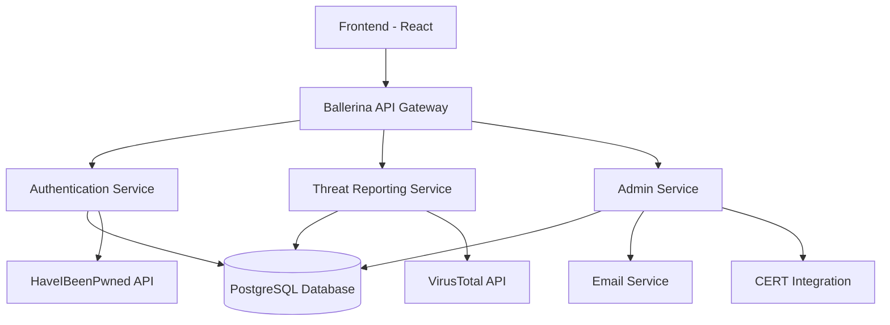

# CyberCare: A Community-Powered Cyber Threat Monitoring System


## 🚀 Project Overview

CyberCare is a cybersecurity platform designed to crowdsource cyber threat reporting while safeguarding user privacy. The system combines breach detection, user alerts, threat submissions, automated validation using services like VirusTotal, and optional escalation to government agencies such as CERT.

This community-driven model aims to strengthen cyber resilience through transparency, quick threat visibility, and responsible disclosure.

## 🏗️ Architecture



## ✨ Key Features

### 👥 User Management
- **Sign Up & Login** with email verification
- **Profile management** with breach history
- **JWT-based session management** with role-based access control
- **Automatic breach checking** on registration and email changes

### 🔍 Breach Detection
- **Integration with HaveIBeenPwned (HIBP)** API
- **Automatic scanning** on user signup and email changes
- **Breach history tracking** and user notifications
- **Email alerts** for detected breaches

### 📊 Threat Reporting
- **Submit cyber threats** with title, description, screenshots, and links
- **Status tracking**: Pending → Validated → False Alarm → Escalated
- **Evidence upload** support (Base64 encoded images)
- **Community-driven threat intelligence**

### 🔐 Automated Threat Validation
- **VirusTotal integration** for URL/IP scanning
- **Auto-classification** based on scan results (>3 hits = Validated)
- **Manual admin review** with override capabilities
- **Threat scoring** and risk assessment

### 🔔 Notification System
- **In-app notifications** for breach detection and report updates
- **Email notifications** via SMTP
- **Real-time status updates** for threat reports
- **Notification history** and management

### 🏛️ CERT Integration
- **Export validated threats** to PDF and JSON formats
- **REST API endpoints** for government integration
- **Automated escalation** for high-risk threats
- **Compliance reporting** features

## 🛠️ Tech Stack

- **Backend**: Ballerina 2201.10.0
- **Database**: PostgreSQL 13+
- **External APIs**: 
  - HaveIBeenPwned API v3
  - VirusTotal API v3
- **Authentication**: JWT with HS256
- **Email**: SMTP integration
- **PDF Generation**: Apache PDFBox

## 📦 Project Structure

```
CyberCare/
├── Ballerina.toml              # Project configuration
├── config.toml                 # Environment configuration
├── types.bal                   # Type definitions
├── auth_service.bal           # Authentication endpoints
├── database_schema.sql        # PostgreSQL schema
├── modules/                   # Custom modules
│   ├── db/                    # Database operations
│   │   └── db.bal
│   ├── auth/                  # JWT authentication
│   │   └── jwt.bal
│   ├── breach/                # HaveIBeenPwned integration
│   │   └── hibp.bal
│   ├── threat/                # VirusTotal integration
│   │   └── virustotal.bal
│   ├── notification/          # Notification system
│   │   └── email.bal
│   └── cert/                  # CERT integration
│       └── export.bal
└── README.md
```

## 🚦 Getting Started

### Prerequisites

1. **Install Ballerina** (2201.10.0 or later)
   ```bash
   # Download from https://ballerina.io/downloads/
   ```

2. **Install PostgreSQL** (13 or later)
   ```bash
   # Ubuntu/Debian
   sudo apt-get install postgresql postgresql-contrib
   
   # macOS
   brew install postgresql
   ```

3. **Get API Keys**
   - HaveIBeenPwned API Key: [HIBP API](https://haveibeenpwned.com/API/Key)
   - VirusTotal API Key: [VirusTotal](https://www.virustotal.com/gui/join-us)

### Installation

1. **Clone the repository**
   ```bash
   git clone <your-repo-url>
   cd CyberCare
   ```

2. **Set up the database**
   ```bash
   # Create database
   createdb cybercare_db
   
   # Run schema
   psql -d cybercare_db -f database_schema.sql
   ```

3. **Configure the application**
   
   Update `config.toml` with your credentials:
   ```toml
   [CyberCare.database]
   host = "localhost"
   port = 5432
   username = "your_db_user"
   password = "your_db_password"
   database = "cybercare_db"
   
   [CyberCare.apis]
   hibp_api_key = "your_hibp_api_key"
   virustotal_api_key = "your_virustotal_api_key"
   
   [CyberCare.email]
   smtp_host = "smtp.gmail.com"
   smtp_port = 587
   username = "your_email@gmail.com"
   password = "your_app_password"
   ```

4. **Install dependencies**
   ```bash
   bal deps
   ```

5. **Run the application**
   ```bash
   bal run
   ```

The server will start on `http://localhost:8080`

## 📚 API Endpoints

### 🔐 Authentication (`/api/auth`)
- `POST /signup` - User registration
- `POST /login` - User login
- `GET /me` - Get current user profile
- `POST /refresh` - Refresh JWT token
- `POST /logout` - User logout

### 📊 Threat Reports (`/api/threats`)
- `POST /report` - Submit new threat report
- `GET /reports` - List all reports (admin)
- `GET /report/{id}` - Get report details
- `PUT /report/{id}/validate` - Validate report (admin)

### 🔔 Notifications (`/api/notifications`)
- `GET /notifications` - Get user notifications
- `PUT /notification/{id}/seen` - Mark notification as seen

### 📈 Admin (`/api/admin`)
- `GET /dashboard` - Dashboard statistics
- `GET /users` - List all users
- `PUT /user/{id}/role` - Update user role

### 🏛️ CERT (`/api/cert`)
- `GET /export/{reportId}/pdf` - Export report as PDF
- `GET /export/{reportId}/json` - Export report as JSON

## 🔧 Development

### Running Tests
```bash
bal test
```

### Code Formatting
```bash
bal format
```

### Building for Production
```bash
bal build
```

## 🚀 Deployment

### Using Docker
```bash
# Build the application
bal build

# Create Docker image
docker build -t cybercare:latest .

# Run container
docker run -p 8080:8080 cybercare:latest
```

### Environment Variables
```bash
export CYBERCARE_DB_HOST=localhost
export CYBERCARE_DB_PASSWORD=your_password
export CYBERCARE_HIBP_API_KEY=your_key
export CYBERCARE_VT_API_KEY=your_key
```

## 🔍 Example Usage

### User Registration with Breach Check
```bash
curl -X POST http://localhost:8080/api/auth/signup \
  -H "Content-Type: application/json" \
  -d '{
    "email": "user@example.com",
    "password": "securePassword123",
    "name": "John Doe"
  }'
```

### Submit Threat Report
```bash
curl -X POST http://localhost:8080/api/threats/report \
  -H "Authorization: Bearer YOUR_JWT_TOKEN" \
  -H "Content-Type: application/json" \
  -d '{
    "title": "Phishing Website",
    "description": "Suspicious website mimicking PayPal login",
    "links": ["http://fake-paypal-site.com"],
    "evidence": "base64_encoded_screenshot"
  }'
```

## 🤝 Contributing

1. Fork the repository
2. Create a feature branch (`git checkout -b feature/amazing-feature`)
3. Commit your changes (`git commit -m 'Add amazing feature'`)
4. Push to the branch (`git push origin feature/amazing-feature`)
5. Open a Pull Request

## 📄 License

This project is licensed under the MIT License - see the [LICENSE](LICENSE) file for details.

## 🆘 Support

- **Documentation**: [Ballerina Docs](https://ballerina.io/learn/)
- **Issues**: Create an issue in this repository
- **Community**: [Ballerina Discord](https://discord.gg/ballerinalang)

## 🚧 Roadmap

- [ ] **Phase 1**: Core functionality (Authentication, Threat Reporting, Basic Validation)
- [ ] **Phase 2**: Advanced features (AI-powered validation, Enhanced CERT integration)
- [ ] **Phase 3**: Mobile app and browser extension
- [ ] **Phase 4**: Machine learning for threat classification
- [ ] **Phase 5**: Integration with more threat intelligence sources

## 👨‍💻 Built With Ballerina

This project showcases Ballerina's capabilities in:
- **Integration**: Seamless API integrations with external services
- **Data processing**: Type-safe data handling and transformation
- **Concurrent programming**: Efficient handling of multiple API calls
- **Security**: Built-in security features and JWT handling
- **Observability**: Built-in logging and monitoring capabilities

---

**CyberCare** - Empowering communities to fight cyber threats together! 🛡️
